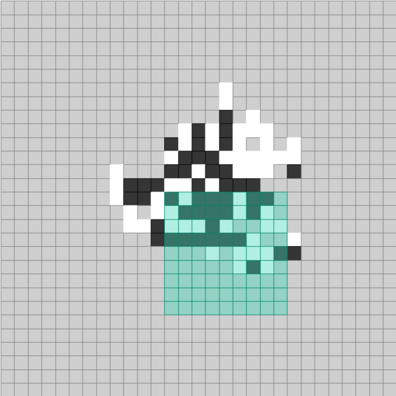

# BeadyRing_DRL
Modeling of urban form based on the 'Beady Ring' model (Hillier & Hanson, 1984) using deep reinforcement learning. 

## Training 

100 eps 

https://user-images.githubusercontent.com/97799869/161741585-b278cf10-3f5d-4200-b371-c1108facaad4.mp4

500 eps 

https://user-images.githubusercontent.com/97799869/161741599-3b975a46-6dcf-47f6-9022-1c056287d30b.mp4

1000+ eps             

https://user-images.githubusercontent.com/97799869/161741606-4e8d4cd4-5a87-416f-83c5-fef1694f0a65.mp4

## State Space
The cells could be in one of 3 different states at a time:
- An empty state (grey)
- A house cell (black)
- A street cell (white)

## Observation
The agent gets a local observation in the form of an array with the states of the cells under the green area surrounding the current action cell (adjustable observation reach), or gets the full state of the environment as an image showing the states of all cells in a full observation version of the environment.

  

